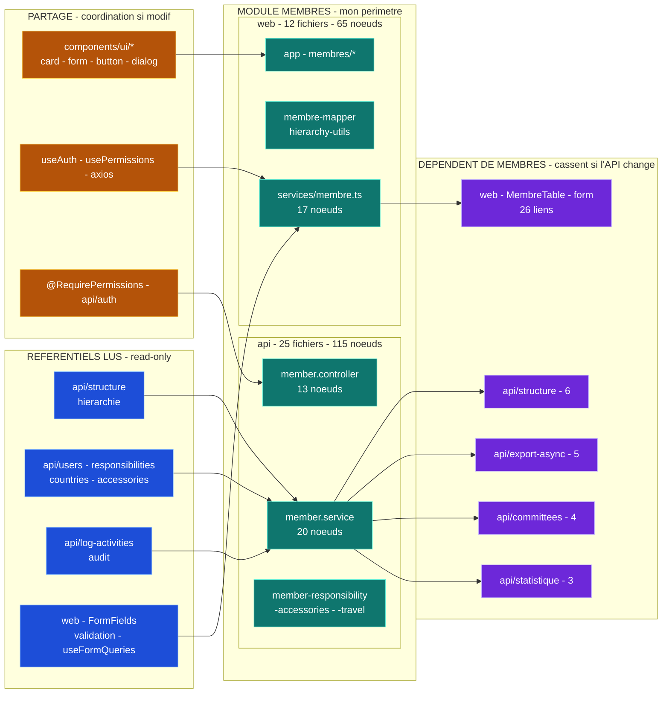

# Cartographie — Module `membres`

> Carte de dépendances du module `membres` (cross-repo `web` + `api`), générée via **Graphify**
> le 2026-07-21. Document canonique dupliqué dans `api/docs/` et `web/docs/`.
> Version interactive (theme-aware) : voir l'artefact Claude partagé à l'équipe.
>
> **But :** rester dans son module et anticiper le **merge global** en connaissant sa surface de couplage.

**Chiffres :** 2 repos · 37 fichiers · 180 nœuds (api : 25 fichiers / 115 · web : 12 / 65).

> ⚠️ **Carte antérieure au chantier « transfert de membres » (livré les 2026-07-22/23).** Les
> chiffres ci-dessous **ne comptent pas** `api/src/member-transfer/` (entités, service,
> contrôleur, `ResponsibilityAnchorService`, migrations) ni, côté web,
> `services/member-transfer.ts`, `hooks/useMemberTransfer.ts`, `types/member-transfer.ts`,
> `components/member-transfer/`, `app/(dashboard)/membres/transferts/`. Deux couplages
> **nouveaux** à connaître avant le merge global :
> - `api/src/members/member.module.ts` importe désormais `MemberTransferModule` (règle d'ancre
>   R8 partagée avec `PUT /members/:uuid` — cf. `TRANSFERT-MEMBRES.md` §5) ;
> - `web/config/menus.ts` (fichier transverse) porte une entrée « Transferts ».
>
> **Ne pas corriger ces chiffres à la main** : relancer `graphify update .` puis régénérer
> l'analyse de périmètre.

## Vue d'ensemble

**Légende :** 🟢 module `membres` (mon périmètre) · 🟠 partagé (coordination si modif) ·
🔵 référentiel lu (read-only) · 🟣 dépendant (casse si l'API change).

## Périmètre du module

### api — 25 fichiers, 115 nœuds
| Fichier | Nœuds |
|---|--:|
| `members/member.service.ts` | 20 |
| `members/member.controller.ts` | 13 |
| `member-accessories/member-accessories.service.ts` | 12 |
| `member-accessories/member-accessories.controller.ts` | 8 |
| `member-travel/*` (service + controller) | 14 |
| `member-responsibility/*` (service + controller) | 10 |
| `members/member.entity.ts` | 4 |
| dto · module · entities (14 fichiers) | 34 |

### web — 12 fichiers, 65 nœuds
| Fichier | Nœuds |
|---|--:|
| `services/membre.ts` | 17 |
| `app/(dashboard)/membres/[uuid]/organization-details.tsx` | 10 |
| `lib/membre-mapper.ts` | 7 |
| `app/(dashboard)/membres/importation/*` (2 pages) | 11 |
| `lib/hierarchy-utils.ts` | 5 |
| `app/(dashboard)/membres/[uuid]/personal-details.tsx` | 4 |
| `ajouter · page · layout · hooks/useMembre` | 11 |

## Surface de couplage — ce que le module consomme

### 🟠 Partagé (🔒 coordination avant modif)
Usage **lecture seule** de primitives/contrats stables — sûr tant qu'on ne les **modifie** pas.

- **UI** `components/ui/*` : `card`(23), `form`(18), `button`(13), `select`(12), `dialog`(11),
  `radio-group`(9), `tabs`(8), `input`(6), `label`(6).
- **Auth / HTTP** : `@RequirePermissions` api/auth (8), `hooks/useAuth`(6), `hooks/usePermissions`(3),
  `lib/axios`(2).

### 🔵 Référentiels lus (read-only — consommer, pas modifier)
| Source | Détail | Liens |
|---|---|--:|
| `api/structure` | `findByAllChildrens`, `getAllSubStructureUuids` | 5 |
| `api/log-activities` | `logAction` (audit) | 10 |
| `api/users · responsibilities · countries` | référentiels | 8 |
| `web/services` | hiérarchie · division · import | 29 |
| `web/lib · types` | validation · mappers · schémas | 62 |
| `web/components/FormFields` | Select pays/ville/structure | 20 |

## 🟣 Dépendent de `membres` — impact au merge global
Ces modules **cassent si l'API `membres` change** (signatures `member.service`, DTO, formats de réponse).

| Module | Repo | Ce qui casse | Liens |
|---|---|---|--:|
| `components/data-table` · MembreTable | web | rendu de la liste des membres | 13 |
| `components/form` | web | formulaires membre | 13 |
| `structure` | api | la hiérarchie lit les membres | 6 |
| `export-async` | api | exports Excel des membres | 5 |
| `committees` | api | comités référencent des membres | 4 |
| `statistique` | api | stats basées sur les membres | 3 |

## ↔ Règle de merge

Le module est **peu risqué en interne** mais **fortement consommé**. Priorité vis-à-vis des autres
modules : garder **stables** les signatures publiques de `member.service` et les formats de
`DTO` / réponses API. On peut refactorer librement l'intérieur ; on ne change pas le **contrat**
sans prévenir l'équipe.

---
_Source : `graphify-out/graph.json` (graphe code-only AST, 6041 nœuds / 437 communautés) · 2026-07-21._
_Régénérer après refactor : `graphify update .` puis relancer l'analyse de périmètre._
