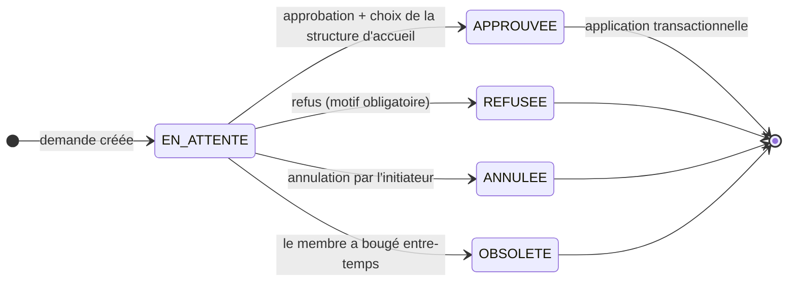

# Transfert de membres entre structures — Cadrage & plan

> **📄 Document de spécification.** Cadrage fonctionnel + plan d'implémentation de la
> fonctionnalité **transfert de membres**. Rédigé le **2026-07-22**, avant toute ligne de code.
> Document canonique **dupliqué dans `api/docs/` et `web/docs/`** (la fonctionnalité est
> transverse aux deux repos) — même convention que `MODULE-MEMBRES.md`.
>
> **Module concerné : `membres`.** Statut : **étapes 1 à 5 livrées et testées** ; reste
> l'étape 6 (documentation transverse).
>
> Historique de la décision : voir l'entrée `2026-07-22` dans les deux `docs/JOURNAL.md`.

## 1. Besoin

Un membre change de structure (déménagement ou autre motif). Aujourd'hui, ce changement se fait
**sans aucun contrôle** : n'importe qui ayant le droit de modifier un membre réécrit
`members.structure_uuid` depuis l'onglet Organisation de la fiche membre
(`web/app/(dashboard)/membres/[uuid]/organization-details.tsx`).

**Objectif : cadrer ce transfert par un circuit de demande → approbation**, et rendre la
mobilité d'un membre traçable.

## 2. Contraintes issues du code existant

Trois faits vérifiés dans le code, qui structurent toute la conception :

1. **Un membre = une seule structure.** `members.structure_uuid`
   (`api/src/members/entities/member.entity.ts:200`), normalement une feuille (groupe /
   sous-groupe). Changer de structure = écrire une colonne.

2. **Un responsable n'habite pas la structure qu'il dirige.** Un responsable de district vit dans
   un sous-groupe *du* district. Sa responsabilité porte le **niveau** ; le rattachement à une
   structure est **calculé** en remontant les ancêtres du membre jusqu'au niveau correspondant
   (`api/src/auth/auth.service.ts:136-151`, `findStructureByLevelUuid` ; même logique commentée
   dans `api/src/structure/structure.service.ts:291-299`).

3. **La barrière d'autorisation existe déjà.** `assertTargetWithinPerimeter()`
   (`api/src/structure/structure-tree.service.ts:1820`) : un non-admin ne peut cibler que ses
   structures de responsabilité et leur sous-arbre. **On la réutilise telle quelle** des deux
   côtés du transfert — pas de nouveau modèle de droits.

**Hiérarchie** (`levels.order`, noms en dur dans `buildBreadcrumb` et `web/lib/hierarchy-utils.ts`) :

```
NATIONAL → REGION → CENTRE_REGIONAL → CENTRE → CHAPITRE → DISTRICT → GROUPE → SOUS_GROUPE
```

## 3. Processus

**Le district est le pivot.** C'est le niveau qui connaît nommément ses membres, et le premier
niveau où « changer de district » a un sens administratif.

**Corollaire :** un déplacement **à l'intérieur d'un même district** (groupe A → groupe B) reste
une simple édition par le responsable de district, **sans workflow**. Sinon on noie l'approbateur
sous des demandes triviales.



### Acteurs et sens

Une seule table, champ `direction` :

| Direction | Initie | Approuve | Statut |
|---|---|---|---|
| `SORTANT` (push) | Responsable du district **source** ou tout supérieur | District **cible** ou tout supérieur | **v1** |
| `ENTRANT` (pull) | Responsable du district **cible** ou tout supérieur | District **source** ou tout supérieur | v2 — modèle déjà prêt, pas de migration à refaire |

**Pourquoi « ou tout supérieur »** : chapitre / centre / centre régional / région / national ont
déjà le district dans leur périmètre via `assertTargetWithinPerimeter`. Cela évite le blocage
total quand la responsabilité de district est vacante ou le responsable absent. Le décideur réel
est tracé dans `decided_by_user_uuid`.

### Granularité du choix

L'initiateur sélectionne **jusqu'au district**. C'est l'approbateur qui choisit le
**groupe / sous-groupe** d'accueil au moment d'approuver — lui seul connaît la répartition
interne de son district.

### Lot

**Côté API : 1 demande = 1 district cible = 1..N membres**, décision **globale**
(all-or-nothing). `CreateMemberTransferDto.member_uuids` est un tableau `@ArrayNotEmpty`.

⚠️ **Côté écran, depuis le 2026-07-25 : 1 demande = 1 seul membre.** Restriction **produit**,
posée uniquement dans `CreateTransferModal` (le sélecteur ne retient qu'un membre et envoie un
tableau à un élément). Le contrat serveur est inchangé et accepte toujours N membres — un appel
API direct ou un futur écran « lot » n'a rien à remigrer. Le cas « une famille déménage » se
traite donc en autant de demandes que de personnes.

## 4. Règles de gestion

| # | Règle |
|---|---|
| **R1** | Source et cible doivent appartenir à **deux districts différents** — sinon `400`, c'est une édition simple |
| **R2** | L'initiateur doit avoir la structure **source** dans son périmètre (`assertTargetWithinPerimeter`) |
| **R3** | L'approbateur doit avoir le district **cible** dans son périmètre |
| **R4** | Un membre ne peut pas avoir **deux demandes en attente** simultanées |
| **R5** | À l'application : **revérifier** que le membre est toujours dans la structure source ; sinon `OBSOLETE` — jamais d'écrasement silencieux |
| **R6** | Refus = **motif obligatoire** ; la demande reste en historique, re-soumission possible |
| **R7** | Toute décision trace `decided_by_user_uuid` + `decided_at` + `logAction()` |
| **R8** | **Règle d'ancre de responsabilité** — voir §5 |
| **R9** | L'aperçu d'impact est calculé **à la création** et **recalculé à l'approbation** |

## 5. R8 — Règle d'ancre de responsabilité

> Une responsabilité de niveau **L** est ancrée sur `ancêtre(structure_du_membre, L)`.
> **Elle est conservée si et seulement si son ancre est inchangée après le transfert :**
>
> ```
> ancêtre(structure_nouvelle, L) == ancêtre(structure_ancienne, L)
> ```

Cette règle n'est pas une invention : elle **formalise le calcul déjà fait par
`findStructureByLevelUuid`** (`auth.service.ts`). Elle se généralise sans table de cas
particuliers.

**Cas de référence** (jeu d'essai canonique des tests unitaires) :

| Cas | Niveau L | Ancre avant → après | Verdict |
|---|---|---|---|
| Responsable **national** change de ville | NATIONAL | racine → racine | ✅ conservée |
| Responsable **centre** change de chapitre (même centre) | CENTRE | Centre X → Centre X | ✅ conservée |
| Responsable **centre** change de centre régional | CENTRE | Centre X → Centre Y | ❌ perdue |

**Conséquences mécaniques**, le workflow ne se déclenchant qu'entre districts différents (R1) :

- Responsabilité **DISTRICT / GROUPE / SOUS_GROUPE** → **toujours perdue** sur un transfert
  workflow (par définition l'ancre a changé).
- Responsabilité **CHAPITRE et au-dessus** → conservée tant qu'on reste sous la même structure
  de ce niveau.
- Responsabilité **NATIONAL** → jamais perdue.

**Traitement d'une responsabilité perdue :**

- **Aperçu à la demande** : le calcul est fait dans tous les cas ; l'écran de confirmation
  n'en affiche que le total (« ⚠️ 1 responsabilité devient vacante si le district d'accueil
  approuve »). Le détail nominatif (« Jean K. perd *Responsable de district CENTRE* ») est
  affiché à l'**approbation**, pas à la demande — cf. §7.
- **À l'application** : soft-delete de la ligne `member_responsibilities` ; l'uuid de la
  responsabilité perdue est figé dans `member_transfer_items.lost_responsibility_uuids`
  → auditable et réversible.
- **Notification** au niveau supérieur de la structure amputée, pour qu'il pourvoie la
  responsabilité vacante.

**Pourquoi R9 n'est pas un risque** : la structure d'accueil finale n'est connue qu'à
l'approbation, mais l'ancre CHAPITRE et au-dessus est déjà déterminée par le **district** cible.
Seuls DISTRICT / GROUPE / SOUS_GROUPE dépendent du choix final — et ils sont perdus dans tous
les cas. **L'aperçu affiché à la création est donc exact.**

**Portée de la règle** : R8 ne doit **pas** vivre uniquement dans le transfert. Un déplacement
intra-district (groupe A → groupe B, édition simple) fait sauter une responsabilité de niveau
GROUPE selon la même règle. D'où une **fonction de domaine unique**,
`computeResponsibilityImpact()`, appelée **et** par l'application du transfert **et** par le
`PUT /members/:uuid` existant. Sinon deux comportements divergents selon le chemin emprunté.

## 6. Effets de bord — inventaire vérifié

| Objet | Impact | Traitement |
|---|---|---|
| `member_responsibilities` | 🔴 Critique | Règle R8 (§5) |
| `committees` / `committee_members` | 🟠 Même problème, **module d'un autre développeur** | Hors v1 — à signaler au merge global |
| Abonnements / dons / paiements | 🟢 Rattachés au membre par `uuid`, jamais à la structure | Rien à faire |
| Accessoires / voyages / activités | 🟢 Rattachés au membre | Rien à faire |
| Statistiques | 🟠 Recalculées à la volée par structure → bascule instantanée, pas d'historique | Accepté en l'état |
| Compte `User` du membre transféré | 🟠 Le JWT embarque structure + responsabilités → token périmé (~8 h) | Reconnexion requise — documenté, non corrigé |
| Exports / imports | 🟢 Lisent l'état courant | Rien à faire |

## 7. Modèle de données

### `member_transfers` — la demande

| Colonne | Type | Note |
|---|---|---|
| `id`, `uuid` | INT AI / CHAR(36) | convention projet |
| `direction` | ENUM(`SORTANT`,`ENTRANT`) | défaut `SORTANT` ; `ENTRANT` réservé v2 |
| `status` | ENUM(`EN_ATTENTE`,`APPROUVEE`,`REFUSEE`,`ANNULEE`,`OBSOLETE`) | |
| `source_district_uuid`, `target_district_uuid` | CHAR(36) | districts résolus à la création |
| `motif` | VARCHAR(50) | `demenagement` \| `autre` |
| `comment` | TEXT NULL | |
| `initiated_by_user_uuid`, `initiated_at` | | |
| `decided_by_user_uuid`, `decided_at`, `decision_comment` | NULL | `decision_comment` obligatoire si refus (R6) |
| `admin_uuid`, `created_at`, `updated_at`, `deleted_at` | | `DateTimeEntity` |

### `member_transfer_items` — une ligne par membre, **et historique de mobilité**

| Colonne | Note |
|---|---|
| `transfer_uuid`, `member_uuid` | UNIQUE(`transfer_uuid`, `member_uuid`) |
| `from_structure_uuid` | figé à la création |
| `to_structure_uuid` | NULL → rempli **à l'approbation** (feuille choisie par la cible) |
| `lost_responsibility_uuids` | JSON — responsabilités soft-deleted à l'application |
| `applied_at` | |

Cette seconde table **est** l'historique de mobilité du membre — pas besoin d'une table d'audit
séparée.

> ⚠️ **R4 sera une garde applicative, pas un index.** MySQL n'a pas d'index unique partiel, et
> `status` vit sur la table parente. Contrôle en transaction avec verrou de ligne + index sur
> `member_uuid`.

**Conventions de schéma retenues** (alignées sur l'existant, pas des choix libres) :

- **Pas de contrainte FK** — le projet joint partout sur `*_uuid` à la main.
- **Pas de `DEFAULT (UUID())`** — blocage binlog STATEMENT déjà rencontré sur cette base
  (`1781400000000-CreateJournalModule`). L'uuid est généré par `@BeforeInsert` côté entité.
- **Collation `utf8mb4_unicode_ci`** — sans quoi les jointures manuelles sur `members.uuid` /
  `structures.uuid` se dégradent.

## 8. API

Base `/member-transfers`, `JwtAuthGuard` + `PermissionsGuard`.

| Verbe | Route | Permission | Rôle |
|---|---|---|---|
| POST | `/impact-preview` | `membres_initier_transfert` | aperçu des responsabilités perdues avant soumission |
| POST | `/` | `membres_initier_transfert` | créer (R1→R4) |
| GET | `/incoming` | `membres_approuver_transfert` | demandes à traiter dans mon périmètre |
| GET | `/outgoing` | `membres_initier_transfert` | demandes que j'ai initiées |
| GET | `/:uuid` | — | détail + impact recalculé |
| POST | `/:uuid/approve` | `membres_approuver_transfert` | body : `placements[{member_uuid, structure_uuid}]` |
| POST | `/:uuid/reject` | `membres_approuver_transfert` | `comment` obligatoire |
| POST | `/:uuid/cancel` | `membres_initier_transfert` | initiateur, si `EN_ATTENTE` |
| GET | `/member/:uuid/history` | `membres_acceder_alonglet_membre` | historique de mobilité |

**Permissions à créer** (table partagée `permissions`, module Membres) :
`membres_voir_menu_transferts`, `membres_initier_transfert`, `membres_approuver_transfert`.

### Application transactionnelle (`approve`)

```
BEGIN
  1. relire la demande avec verrou, vérifier EN_ATTENTE
  2. par item : member.structure_uuid === from_structure_uuid ?
       sinon → status = OBSOLETE, ROLLBACK, 409          (R5)
  3. valider chaque placement : dans le sous-arbre du district cible,
     et de niveau GROUPE ou SOUS_GROUPE
  4. computeResponsibilityImpact → soft-delete des « lost »,
     uuids figés dans l'item                              (R8)
  5. members.structure_uuid = to_structure_uuid
  6. transfer → APPROUVEE, decided_by / decided_at        (R7)
COMMIT
puis logAction('member_transfer.approved', …)   // hors transaction
```

## 9. Plan d'implémentation

Emplacement API : nouveau module **`api/src/member-transfer/`** — cohérent avec
`member-responsibility`, `member-accessories`, `member-travel`, et **dans le périmètre du module
`membres`**.
Emplacement web : `services/member-transfer.ts`, `hooks/useMemberTransfer.ts`,
`app/(dashboard)/membres/transferts/`.

### Étape 1 — Socle domaine (api) · ✅ **livrée le 2026-07-22** (migration non exécutée)

1. Migration `17825xxxxxxxx-CreateMemberTransfer.ts` — mêmes garde-fous que
   `CreateCommitteeMembersAndResponsible` (`hasTable`/`hasColumn`, idempotente, `down()`
   réversible). 🔒 *Migration = `soka_db` partagée → prévenir l'équipe avant `migration:run`.*
2. Entités `member-transfer.entity.ts`, `member-transfer-item.entity.ts`.
3. **`ResponsibilityAnchorService`** — cœur métier, isolé et testable :
   ```ts
   ancestorAtLevel(structureUuid, levelUuid): string | null
   resolveDistrict(structureUuid): string | null
   computeResponsibilityImpact(memberUuid, fromStructureUuid, toStructureUuid)
     → { kept: Responsibility[], lost: Responsibility[] }
   ```
   Implémentation : **un seul `find()`** sur `structures (uuid, parent_uuid, level_uuid)` puis
   remontée en mémoire — même approche que `getAllSubStructureUuids()`, pour ne pas refaire les
   milliers de requêtes qui avaient causé le timeout passerelle.
4. Tests unitaires de R8 sur les trois cas de référence (§5) + cas district / groupe.

**Livré :** `src/migrations/1782500000000-CreateMemberTransfer.ts`,
`src/member-transfer/entities/{member-transfer,member-transfer-item}.entity.ts`,
`responsibility-anchor.service.ts`, `member-transfer.module.ts`,
`responsibility-anchor.service.spec.ts` (19 tests, verts ; `npx jest src/member-transfer`).
`nest build` OK. **La migration n'a pas été exécutée** — en attente de coordination équipe.
Le module n'est pas encore importé dans `app.module.ts` (fichier partagé, étape 2).

### Étape 2 — Service + API · ✅ **livrée le 2026-07-22**
DTO, contrôleur, les 9 endpoints, l'application transactionnelle, les permissions.

**Livré :** `member-transfer.service.ts`, `member-transfer.controller.ts`, `dto/*`,
migration `1782500100000-AddMemberTransferPermissions`, import dans `app.module.ts`.
**Migrations exécutées** sur `soka_db`. **24 assertions E2E vertes** contre l'API réelle
(R1, R4, R6, validation des placements, approbation transactionnelle, R8 sur données réelles,
double approbation, historique).

**Permissions attribuées au rôle `RESPONSABLE`** le 2026-07-23. ⚠️ C'est bien ce rôle qu'il faut
viser : `user_roles` est vide, et les permissions d'un non-admin viennent du rôle porté par sa
**responsabilité** (`responsibilities.role_uuid`), toutes rattachées à `RESPONSABLE`.

**R2 et R3 validés avec de vrais responsables non-admin** (25 + 6 assertions) :

| Acteur | Action | Résultat |
|---|---|---|
| Resp. district VOMANZI | initier VOMANZI → TCHIVA | ✅ autorisé |
| Resp. district VOMANZI | approuver sa propre demande vers TCHIVA | ⛔ **403** (R3) |
| Resp. district VOMANZI | initier depuis TCHIVA | ⛔ **403** (R2) |
| Resp. chapitre KAVOMANZINÉ | initier et approuver dans les deux sens | ✅ autorisé (« ou tout supérieur ») |

**Anomalies de données constatées** (hors périmètre, à traiter séparément) :
- **104 membres rattachés à un CHAPITRE**, donc sans district source → le service les refuse
  nommément plutôt que d'échouer obscurément.
- **`Responsable jeunes hommes CHAPITRE` a `level_uuid = NULL`** (104 porteurs) → cas
  `undetermined` : responsabilité conservée par défaut. À corriger dans `responsibilities`,
  sinon elle suivra son porteur d'un chapitre à l'autre.
- **`membres_modifier_un_membre` n'existe pas** dans `permissions` alors que
  `PUT /members/:uuid` l'exige → seuls les admins peuvent modifier un membre aujourd'hui.

### Étapes 3 & 4 — Web · ✅ **livrées le 2026-07-23**

`types/member-transfer.ts`, `services/member-transfer.ts`, `hooks/useMemberTransfer.ts`,
page `app/(dashboard)/membres/transferts/` (onglets Reçues / Envoyées + badge), et
`components/member-transfer/` : `CreateTransferModal`, `ApproveTransferModal`, `TransferTable`,
`TransferStatusBadge`, `ImpactPreviewPanel`, `StructureCascadeSelect`. `tsc --noEmit` :
**0 erreur**. Parcours vérifié dans le navigateur.

🔒 **Menu** (`config/menus.ts`, fichier transverse) : « Transferts » est un **enfant de
« Membres »**, aux côtés de « Liste des membres » — un transfert est une opération *sur* les
membres, pas un domaine de premier niveau. ⚠️ Conséquence : l'entrée « Membres » n'a plus de
`href` et se **déplie** au lieu de naviguer, comme « journaux » et « Paramètres ».

⚠️ **Les permissions sont chargées au login** : un utilisateur déjà connecté ne verra le menu
qu'après reconnexion.

#### Détail — Étape 3 : liste et création
`services/member-transfer.ts` + `hooks/useMemberTransfer.ts` (react-query v5).
Page `membres/transferts/` : onglets **Reçues** / **Envoyées**, badge sur les `EN_ATTENTE`
reçues. Modale de création : sélecteur de membres scopé au périmètre, cascade de structures
jusqu'au district via **`useStructureFilterCascade`** (déjà écrit, gère les 7 paliers dont
`CENTRE_REGIONAL`).

> **La vérification d'impact est sur le chemin obligatoire de l'envoi** (depuis le 2026-07-25).
> « Envoyer la demande » appelle `/impact-preview`, puis ouvre **`ConfirmTransferModal`**. C'est le
> bouton « Confirmer et envoyer » de cette seconde modale qui crée réellement la demande. Si
> `/impact-preview` échoue, **rien n'est envoyé**. Avant, l'aperçu était un bouton facultatif à côté
> du formulaire, donc contournable : on pouvait soumettre sans jamais voir qu'une responsabilité
> allait devenir vacante.
>
> ⚠️ **Ce que `ConfirmTransferModal` affiche a été réduit le 2026-07-25** (demande de recette) :
> récapitulatif (membre, district, motif, précision) + **avertissement agrégé** « N responsabilités
> deviennent vacantes », affiché seulement s'il y a perte. Le **détail** par responsabilité
> (`ImpactPreviewPanel`) n'y est plus. L'appel `/impact-preview` et le blocage en cas d'échec sont
> **inchangés** : c'est l'affichage du détail qui a été retiré, pas la vérification. Le détail
> complet reste sur `ApproveTransferModal`, côté approbateur — celui dont la décision applique
> réellement le transfert.
> ⚠️ `ConfirmTransferModal` s'empile au-dessus de `CreateTransferModal` : ses `z-index` sont
> forcés au-dessus de ceux de `DialogContent` (contenu `z-[9999]`, overlay `z-[999]`).

> **Pas de bouton dans `MembreTable.tsx` en v1** : consommateur fortement lié du module, autant
> ne pas créer de surface de conflit au merge global. La création part de la page transferts.

#### Détail — Étape 4 : approbation
Modale : par membre, un select de structure d'accueil restreint au sous-arbre du district cible
(niveaux GROUPE / SOUS_GROUPE), plus le rappel explicite des responsabilités perdues. Refus :
motif obligatoire, bouton désactivé tant qu'il est vide.

### Étape 5 — Cohérence globale · ✅ **livrée le 2026-07-23**

Objectif : **il n'existe plus de chemin qui déplace un membre sans appliquer R8.**

**Livré côté api** — `member.service.ts` (`update()`) consomme désormais
`ResponsibilityAnchorService`, exporté par `MemberTransferModule` (importé dans
`member.module.ts`) :

1. **Frontière de district → 400.** Un `PUT` qui ferait changer le membre de district est
   refusé : « …il doit passer par une demande de transfert ». Le workflow d'approbation ne
   peut plus être contourné par l'édition libre de l'onglet Organisation.
2. **R8 sur l'édition simple.** Un déplacement intra-district passe par
   `computeResponsibilityImpact` : les responsabilités dont l'ancre a changé sont
   soft-deletées, exactement comme à l'application d'un transfert, et tracées via
   `logAction('members-responsibility-anchor-lost', …)`.
3. La structure d'accueil est vérifiée existante (elle ne l'était pas du tout auparavant).

**Livré côté web** — `components/member-transfer/MemberTransferHistory.tsx` + onglet
**Historique** dans `membres/[uuid]/page.tsx`. Le composant n'est monté qu'à l'ouverture de
l'onglet, pour ne pas appeler `/history` à chaque consultation de fiche.

> **⚠️ Échappatoire volontaire — membre rattaché au-dessus du district.** Le refus (1) ne se
> déclenche que si les **deux** districts sont déterminables. Un membre rattaché à un CHAPITRE
> (anomalie connue, 104 cas) n'a pas de district source ; comme le workflow de transfert le
> refuse déjà pour cette raison, bloquer aussi le `PUT` le rendrait **définitivement immobile**.
> On laisse donc passer la réparation — R8 s'applique quand même.

**Limites assumées :**
- `update()` **n'est pas transactionnel** (état existant du service, non refactoré ici) : le
  soft-delete R8 est fait **après** le déplacement, pour qu'un échec laisse au pire une
  responsabilité à retirer à la main plutôt qu'une responsabilité perdue sans déplacement.
- **Asymétrie de périmètre non corrigée** : `update()` vérifie que la structure **source** est
  dans le périmètre, pas la **cible**. Et `MemberService.assertStructureInScope` dérive le
  périmètre de la structure *où habite* le demandeur, alors que le module transfert utilise ses
  *structures de responsabilité* — deux notions différentes. Sans effet pratique aujourd'hui
  (`membres_modifier_un_membre` n'existe pas en base → `PUT` réservé aux `is_admin`), mais à
  unifier au merge global, en même temps que le helper de périmètre partagé.
- L'onglet Historique ne montre que les déplacements passés par le **workflow** : une édition
  simple intra-district ne laisse pas de ligne dans `member_transfer_items`.

### Étape 6 — Documentation
Mise à jour de `api/CLAUDE.md`, `web/CLAUDE.md`, `MODULE-MEMBRES.md` (le périmètre s'étend), et
entrée datée dans les **deux** `docs/JOURNAL.md`. Puis `graphify update .`.

## 10. Hors périmètre v1 — assumé

| Point | Raison |
|---|---|
| Comités (`committees`, `committee_members`) | Module d'un autre développeur — à signaler au merge global |
| Notifications mail / SMS | `mail.module.ts` n'est qu'une config mailer, aucun service ; le badge in-app suffit en v1 |
| Direction `ENTRANT` (pull) | Colonne créée, endpoints v2 — pas de migration à refaire |
| Relances / SLA sur demandes dormantes | Cron, v2 |
| Historisation des statistiques | Pas d'historique aujourd'hui ; hors sujet ici |

## 11. Pièges connus

1. **`member_responsibilities` se joint sur `member_uuid` / `responsibility_uuid`** — les FK
   numériques sont NULL sur toutes les lignes migrées. Piège déjà documenté dans `api/CLAUDE.md`,
   à ne pas rejouer.
2. **Token JWT périmé** : le membre transféré qui a un compte garde une structure et des
   responsabilités obsolètes dans son token (~8 h). Reconnexion nécessaire.
3. **Comptes de test** : `calixmonnet` a `is_admin = 1` → court-circuite **et** le
   `PermissionsGuard` **et** tous les contrôles de périmètre. Inutilisable pour tester les
   gardes ; utile en revanche pour valider la seule mécanique.
4. **Les permissions sont chargées au login** : accorder une permission à quelqu'un déjà
   connecté n'a aucun effet avant sa reconnexion.

## 12. Jeu de test (base de dev `soka_db`)

Repéré et rejoué le 2026-07-23. Ces uuid sont ceux de la base de développement — les revalider
avant de s'en servir ailleurs.

**Acteurs** (mot de passe passe-partout `nrh2030`, actif seulement si `APP_ENV=development`) :

| Téléphone | Rôle réel | Sert à |
|---|---|---|
| `0566476482` | Responsable **DISTRICT VOMANZI** | initiateur — et cobaye des refus R2/R3 |
| `0544450047` | Responsable **CHAPITRE KAVOMANZINÉ** | approbateur — couvre les deux districts |
| `0151645214` | `is_admin = 1` | mécanique seule, contourne les périmètres |

**Structures** : chapitre KAVOMANZINÉ `0169d6a8-…` contient les districts **VOMANZI**
`a45f1ae0-…` (source) et **TCHIVA** `ea95f11c-…` (cible, sans responsable district → oblige à
passer par le niveau supérieur, ce qui valide la règle « ou tout supérieur »).

**Trio de membres couvrant les trois verdicts de R8** — c'est le jeu d'essai qui rend le test
concluant :

| Membre | Responsabilité | Verdict attendu |
|---|---|---|
| KOUAME DENIS `4068917f-…` | Responsable **groupe** | ❌ perdue (ancre groupe change) |
| LOU IRITIENAN THERESE `56e9d861-…` | Responsable femme **CHAPITRE** | ✅ conservée (même chapitre) |
| BI BONY `564ec3ea-…` | Resp. jeunes hommes CHAPITRE, `level_uuid` **NULL** | ✅ conservée + `undetermined` |

**Scénario rejoué** (55 assertions au total) : aperçu d'impact → R1 (même district) → création →
R4 (doublon) → R6 (refus sans motif) → placements invalides (hors district / district lui-même /
manquant) → R3 (l'initiateur ne peut pas approuver) → approbation → double approbation → R2
(initier hors périmètre) → districts sources mélangés → historique.

⚠️ **Le scénario mute des données réelles** (`members.structure_uuid`, soft-delete de
`member_responsibilities`). Il a été joué avec un instantané avant / restauration après, et la
base a été vérifiée conforme ensuite. Les scripts étaient ad hoc (hors dépôt) — **à réécrire en
test automatisé si on veut en faire une non-régression**, sans quoi il faut refaire l'instantané
à la main.

---
_Cadrage du 2026-07-22 · module `membres`._
_Statut au 2026-07-23 : **étapes 1 à 5 livrées et testées** ; reste l'étape 6 (documentation
transverse : `MODULE-MEMBRES.md`, `graphify update .`)._
